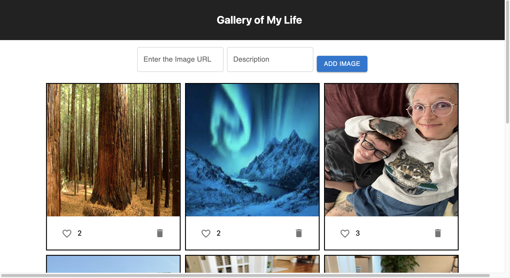
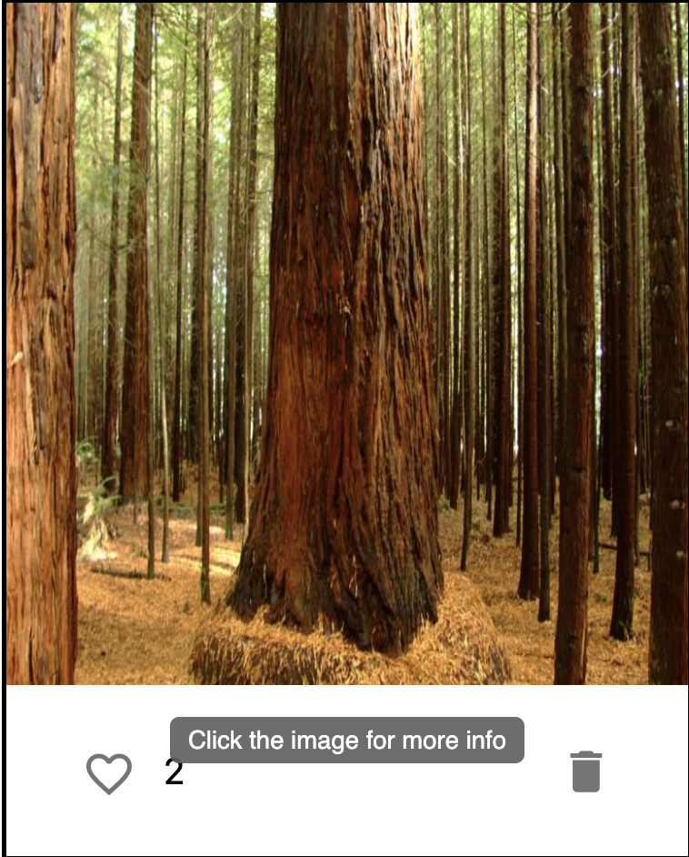
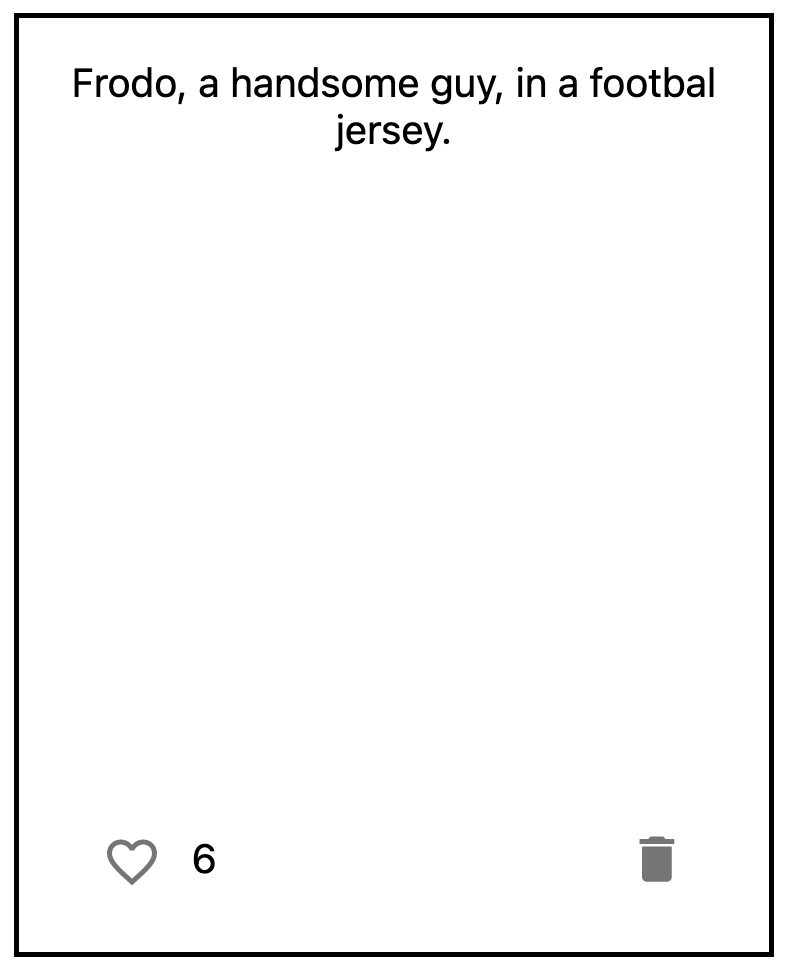
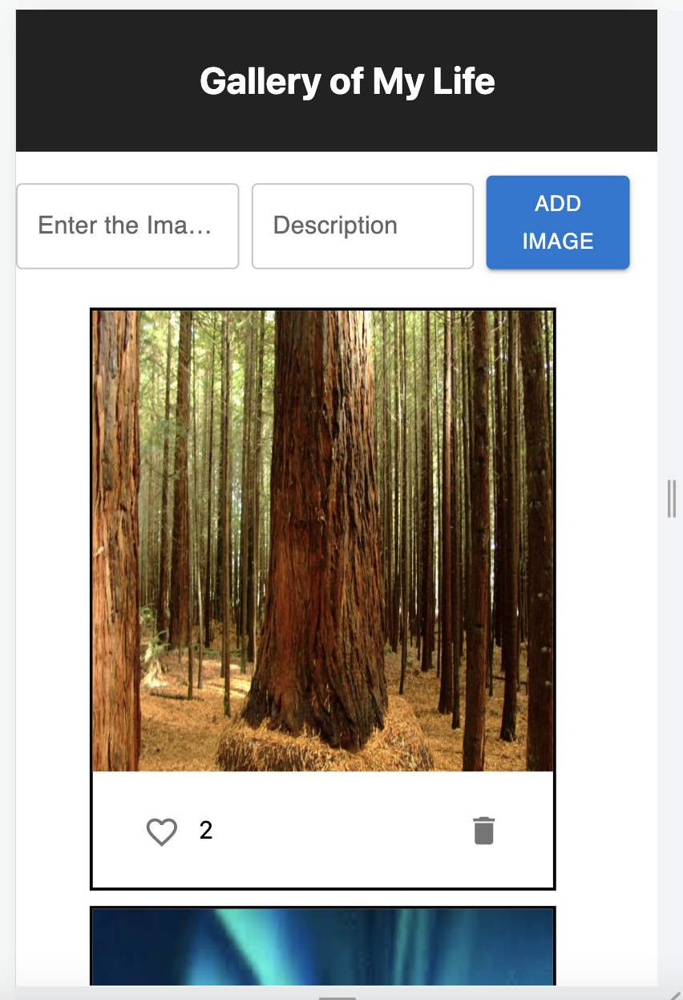

# React Photo Gallery App

## Description

_Tier 2/Week 10_
_3 Day Project_

I created a photo gallery app using React.  The app can add and delete photos.  The user also has the ability to like photos in the gallery and see more details by clicking on the image.  There are several modals included in the app that warn a user before deleting an image and also reminding them to complete all required fields.

To see my repository, please visit: [GitHub Repository](https://github.com/sam-c-freeman/weekend-react-gallery)

To see my app, please visit: [Heroku Hosted App](https://sleepy-coast-58101.herokuapp.com/)

## Screen Shots

## Usage
Features:

1. Can add new photos
2. Uses a database so photos and likes aren't lost
2. Can delete photos 
3. Modals are included in the app to help guide the user with important actions
4. Tooltips are included to help guide the user through the app's UI
5. Looks great on mobile devices

## Built With

* HTML
* CSS
* Javascript
* React
* SQL
* Material UI
* Sweet Alerts
* Node.js
* Express

## Acknowledgement
Thanks to [Prime Digital Academy](www.primeacademy.io) who equipped and helped me to make this application a reality. 

## Support
If you have suggestions or issues, please email me at: <samcfreeman888@gmail.com>